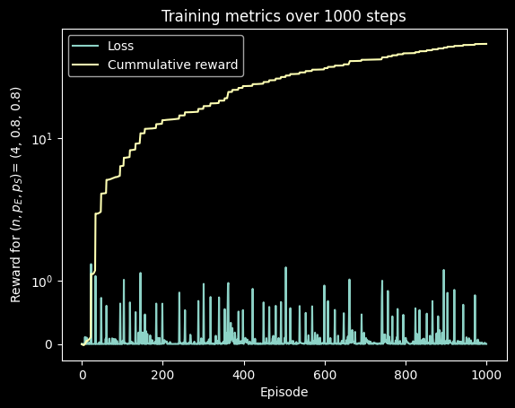
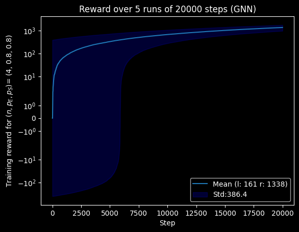
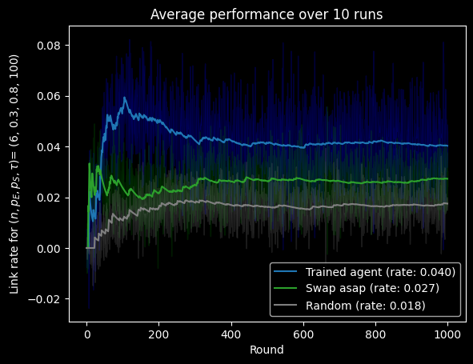

# Learning scalable entanglement distribution (QRN-RL-GNN)


<div align='center'>


</div>

This is the repository for studying entanglement distribution in quantum **repeater networks** using Reinforcement Learning. The goal of this project is to examine how Reinforcement Learning agents can learn efficient policies for enanglement distribution in 1D repeater chains. The aim is that given a set of physical parameters $C_n$ an agent can establish a policy $\pi_n$ through the mapping:

$$ 
\pi(C_n; NN) = \pi
$$
where, $C_N = (n, p_e, p_s, \tau)$ and $NN$ encodes the neural network parameters. Afterwards, this policy is to be evaluated on a different set of physical parameters $C_{n'}$ and hopefuly we can find an agent that can learn optimal policies that can transfer to systems of different sizes.

The graph neural network is able to find strategies in order to achieve end-to-end entanglement in quantum networks of fixed size. It achieves high cummulative reward with relativelly few training steps:



This behaviour is pretty robust to the random initialization of the networks weights, indicative of a good quality of the learning algorithm `AgentGNN().train()` in the [agent](./src/agent.py) file:



The validation performance of the network indicates that it can easily outperform the [Swap-asap](https://quantum-journal.org/papers/q-2025-05-15-1744/) strategy



As previous research has suggested, the learning agent performs best (compared to the swap-asap strategy) in the $C_n$ regime where $p_e \ll 1$ and $p_s \ll 1$. This is verified here by the means of a relative performance heatmap:


> [!NOTE]
>Additionally, there is a simple tabular puzzle game that translates the system into a more interpretable version that can also be played by humans [Qonnect](https://github.com/chrishalkias/qonnect)!


## About the code
The repository's main files are located into the `src` folder. The `assets` folder consists of all of the programs output including plots and model files. The full code structure can be found below:

```
.

├── assets
│   ├── gnn_model.pth
│   ├── n_scaling.png
│   ├── test_stats.png
│   ├── train_stats.png
│   └── train.png
├── display
│   ├── n_scaling_disp.png
│   ├── test_stats_disp.png
│   ├── train_stats_disp.png
│   └── train_disp.png
├── src
│   ├── agent.py
│   ├── main.py
│   ├── model.py
│   ├── notebook.ipynb
│   ├── repeaters.py
│   ├── test.py
│   └── stats.py
├── .gitignore
├── LICENSE
├── README.md
└── requirements.txt
```
>[!WARNING]
> The `/QRN-RL-GNN/src/notebook.ipynb` is used as the main file of the simulation. This is because of a yet to be fixed bug in the `/QRN-RL-GNN/src/main.ipynb` file.

## Instalation
  You can install the code by cloning the repository:
```

git clone https://github.com/chrishalkias/QRN-RL-GNN

```

## Additional Information
The physical system used is Quantum repeaters. Big picture and outlook YouTube video from [QuTech](https://www.youtube.com/watch?v=9iCFH9Fk184) and [Qunnect (animation)](https://www.youtube.com/watch?v=3_oqkFO4f-A). The project has a similar scope to [Haldar et al.](https://arxiv.org/abs/2303.00777) but the idea is to use more state of the art architectures for the RL agent (such as graph neural netowkrs) to extend to scale ($n$) invariant models.

This work was done as part of my MSc project for Leiden University under the supervision of [Evert van Nieuwenburg](https://github.com/everthemore).


  

