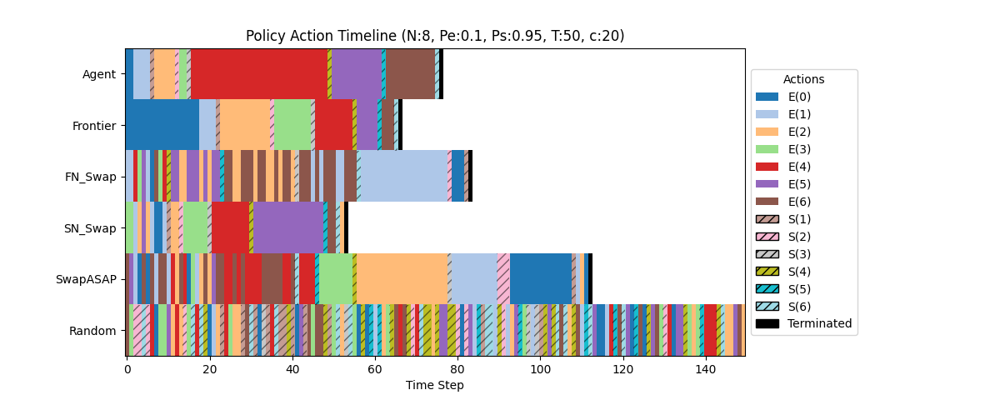
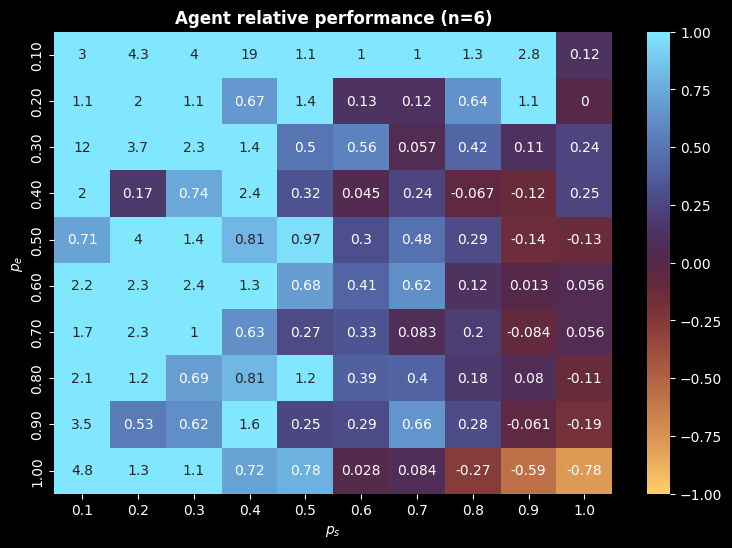

# Learning scalable entanglement distribution


>[!WARNING]
>Work in progress.


<div align='center'>


</div>

This is the repository for studying entanglement distribution in quantum **repeater networks** using Reinforcement Learning. 

- [Project description](#About-the-project)
- [Code description](#about-the-code)
- [Instalation](#instalation)
- [Additional information](#additional-information)

## About the project


The goal of this project is to examine how Reinforcement Learning (RL) agents can learn efficient policies for enanglement distribution in 1D repeater chains. The aim is that given a set of physical parameters $C_n$ an agent can establish a policy $\pi_n$ through the mapping:

$$ 
\pi(C_N; \text{NN}) = \pi
$$


$C_N = (N, p_e, p_s, \tau)$ and $NN$ encodes the neural network parameters.  Afterwards, this policy is evaluated on a different set of physical parameters $C_{n'}$. We use Graph Neural networks (GNN) with the hope that the learned policies are size independent i.e for $N\neq M$

$$
\pi(C_N; G\text{NN}) = \pi(C_M; G\text{NN})
$$

### Training
During training the agent is tested using a Deep Q-Learning scheme. Training is done on some $n$, or a range of $n$ via the `jitter=True` argument.


### Validation

The agent is tested agains known strategies, including:

- Farthest Neighbour SwapASAP
- Strongest Neighbour SwapASAP
- Random SwapASAP
- Stochastic actions


> [!NOTE]
>Additionally, there is a simple tabular puzzle game that translates the system into a more interpretable version that can also be played by humans [Qonnect](https://github.com/chrishalkias/qonnect)!


## About the code

The project consists of three main components, seperated in three distinct objects:

- [The system simulator](#quantum-repeater-network)
- [The Reinforcement Learning agent](#deep-q-learning-agent)
- [The neural network model]()

### Quantum repeater network

The `src/base/repeaters.py` module contains the base class for the underlying quantum simulator. This is a computational abstraction of the physical many-body system that is simulated. A simple intialization and opearation of the system is as follows:

```python
from base.repeaters import RepeaterNetwork
net = RepeaterNetwork(n=3) # <-- Defaults to perfect operations
net.entangle(edge=(0,1)) # <-- Entangles repeater (node) 1 with repeater 2
net.entangle(edge=(1,2))
net.swapAT(node=1) # <-- Since the (0,1) and (1,2) connections exist this results in (0,1) connection
net.checkEndtoEnd()
```

The state of the system is stored in a tensorised way using a `pytorch_geometric.Data` object. Each state has the following attributes:

```python
state = RepeaterNetwork().tensorState()
nodes = state.x #<-- node features (one hot connections)
edges = state.edge_attr # <-- edge features (entanglement fidelities)
adj = state.edge_index # <-- The adjecency matrix
```
The module is called, and acted upon by the Agent class.

### Deep Q-Learning Agent

The `src/agent.py` module acts as the agent that performs actions on the environment (the `RepeaterNetwork` class). Here, the training and validation of the agent are treated as methods of the `AgentGNN` class. The training loop amounts to calling the associated method:

```python
from base.agent import QRNAgent
agent = QRNAgent()
agent.train(episodes=1000, max_steps=50)
```
This trains on a defaul variables. A sample dict can be passed with the desired kwargs

```python
train_args = {
	'episodes': 10_000,
	'max_steps': 50,
	'savemodel': True,
	'plot': True,
	'jitter': 500,
	'fine_tune': False,
	'n_range': [4,6],
	'p_e': 0.85,
	'p_s': 0.95,
	'tau': 50,
	'cutoff': 40,
	'use_wandb': True, 
	}

  agent.train(**train_args)
```


The agent uses

The same logic follow for the validation of the model but now an additional `dict_dir` is required to load the trained dictionary.

```python
agent.validate(dict_dir='<the trained dict>', **val_args)
```

By default, the trained dictionary is saved under `./assets/trained_models/model_name/model_name.pth`. All subsequent plots (training, validation, testing) that concern this model are also saved under tha same directory.

The agent, utilizes a GNN model for the target and policy networks. This is what offers its generalization capacities. 

### Graph attention network

The graph attention network is a small class with a simple GNN architecture to be used to store the environment model of the RL agent. By default the model is comprised of one `GATv2Conv` layer and two fully connected layers. The model is intended to be light-weight. For a 4-node network there are ~1k parameters:

```python
+-----------------------+----------------+----------------+----------+
| Layer                 | Input Shape    | Output Shape   | Params   |
|-----------------------+----------------+----------------+----------|
| GNN                   | [8, 8]         | [8, 2]         | 1346     |
| ├─(encoder)Sequential | --             | --             | 224      |
| │    └─(0)GATv2Conv   | [8, 1], [2, 7] | [8, 32]        | 224      |
| ├─(decoder)Sequential | [8, 32]        | [8, 2]         | 1122     |
| │    └─(0)Linear      | [8, 32]        | [8, 32]        | 1056     |
| │    └─(1)ReLU        | [8, 32]        | [8, 32]        | --       |
| │    └─(2)Linear      | [8, 32]        | [8, 2]         | 66       |
+-----------------------+----------------+----------------+----------+
Total parameters: 1346

```

## Performance

The performance of the agent is close to state of the art strategies

```text
--- Validation (N:8, Pe:0.1, Ps:0.95, tau:50, cutoff:20) ---
--- Max_steps: 150, n_episodes:1000, Model: d(18-2)l4u6e1000m100p85a95t500c200 --
======================================================================
Strategy     | Avg Steps (std)     | Avg Fidelity (std) | S%   | F%   
----------------------------------------------------------------------
Agent        | 76.51     (±24.10 ) | 0.6970   (±0.0030) | 100% | 100% 
Frontier     | 79.16     (±25.82 ) | 0.6977   (±0.0000) | 103% | 100% 
FN_Swap      | 76.85     (±25.02 ) | 0.6971   (±0.0028) | 100% | 100% 
SN_Swap      | 77.09     (±24.96 ) | 0.6971   (±0.0027) | 101% | 100% 
SwapASAP     | 77.52     (±24.76 ) | 0.6972   (±0.0027) | 101% | 100% 
Random       | 150.00    (±0.00  ) | 0.0000   (±0.0000) | 196% | 0%
```

<div align="center">

</div>


The relative performance of the agent with the (random) swap-asap policy increases with increasing $p_e$ and decreasing $p_s$

<div align="center">

</div>


## Installation
  You can install the code by cloning the repository:

```bash
git clone https://github.com/chrishalkias/QRN-RL-GNN
```

and installing the required packages

```bash
pip install -r requirements.txt
```


## Additional Information
The physical system used is Quantum repeaters. Big picture and outlook YouTube video from [QuTech](https://www.youtube.com/watch?v=9iCFH9Fk184) and [Qunnect (animation)](https://www.youtube.com/watch?v=3_oqkFO4f-A). The project has a similar scope to [Haldar et al.](https://arxiv.org/abs/2303.00777) but the idea is to use more state of the art architectures for the RL agent (such as graph neural netowkrs) to extend to scale ($n$) invariant models.


  

